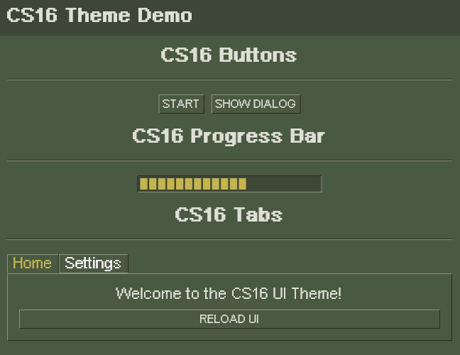

<div style="display: flex; align-items: center; gap: 20px;">
  
  <div>
    <h1>Flutter CS16 Theme</h1>
    <p>
      A <strong>Counter-Strike 1.6 (CS16) inspired UI theme</strong> for Flutter applications.  
      This package provides <strong>custom widgets and styles</strong> that replicate the  
      <strong>classic FPS game's UI</strong>, including buttons, dividers, dialogs,  
      progress bars, and tab navigation.
    </p>
  </div>
</div>

## **📌 Features**
- **Custom CS16-Inspired UI Components**
  - **CS16Button** – Retro-styled buttons with interactive states.
  - **CS16Divider** – Two-tone horizontal dividers for section separation.
  - **CS16Dialog** – Themed dialog boxes matching CS16's aesthetic.
  - **CS16ProgressBar** – Segmented progress bar with CS16-inspired design.
  - **CS16Tabs** – Tab navigation with pixelated CS16-style tabs.
- **Dark theme with CS16 colors (`CS16Theme`)**.
- **Minimalist, lightweight, and customizable UI components**.
- **No external dependencies** (other than Flutter's core widgets).
- **Perfect for FPS-style menus, settings screens, and HUDs**.

---

## **📦 Installation**

### **1. Add Dependency**
Add the following to `pubspec.yaml`:

```yaml
dependencies:
  flutter:
    sdk: flutter
  flutter_cs16_theme:
    git:
      url: https://github.com/evokelektrique/flutter-cs16-theme.git
```

### **2. Import the Library**
```dart
import 'package:flutter_cs16_theme/flutter_cs16_theme.dart';
```

---

## **🚀 Example Usage**
### **Basic UI with CS16 Theme**
This example showcases a **menu-style layout** using CS16 buttons, dividers, a progress bar, and tab navigation.

```dart
import 'package:flutter/material.dart';
import 'package:flutter_cs16_theme/flutter_cs16_theme.dart';

void main() {
  runApp(MyApp());
}

class MyApp extends StatelessWidget {
  @override
  Widget build(BuildContext context) {
    return MaterialApp(
      theme: CS16Theme.darkTheme, // Apply CS16 Dark Theme
      home: Scaffold(
        body: Column(
          mainAxisAlignment: MainAxisAlignment.center,
          children: [
            CS16Button(
              text: "Start Game",
              onPressed: () => print("Game Started!"),
            ),
            CS16Divider(), // Retro-style divider
            CS16ProgressBar(progress: 0.75), // 75% progress
            CS16Tabs(
              tabs: ["Weapons", "Settings"],
              tabViews: [
                Center(child: Text("Weapon List")),
                Center(child: Text("Game Settings")),
              ],
            ),
          ],
        ),
      ),
    );
  }
}
```

---

## **🎨 Theme Configuration**
The **CS16 Dark Theme** provides **a retro aesthetic**. You can apply it globally using:

```dart
MaterialApp(
  theme: CS16Theme.darkTheme,
  home: MyApp(),
);
```

The theme applies CS16 colors to:
- **Backgrounds**
- **Buttons**
- **AppBars**
- **Text styles**

---

## **🔹 Widget Documentation**

### **1️⃣ CS16Button**
A **Counter-Strike 1.6 style button** with a pixelated, low-resolution look.

```dart
CS16Button(
  text: "Join Server",
  onPressed: () {},
  fontSize: 14, // Custom text size
  backgroundColor: Colors.black, // Custom button background
  textColor: Colors.green, // Custom text color
);
```

---

### **2️⃣ CS16Divider**
A **simple two-tone divider** for UI section separation.

```dart
CS16Divider();
```

---

### **3️⃣ CS16Dialog**
A **classic CS16-style dialog box**.

```dart
showDialog(
  context: context,
  builder: (context) {
    return CS16Dialog(
      title: "Error",
      content: "Connection lost.",
      actions: [
        CS16Button(
          text: "Retry",
          onPressed: () {
            Navigator.pop(context);
          },
        ),
      ],
    );
  },
);
```

---

### **4️⃣ CS16ProgressBar**
A **segmented progress bar** that visually represents a loading state.

```dart
CS16ProgressBar(
  progress: 0.5, // 50% progress
  width: 300, // Custom width
  height: 30, // Custom height
  segments: 25, // More segments for finer granularity
);
```

---

### **5️⃣ CS16Tabs**
A **CS16-themed tab navigation system**.

```dart
CS16Tabs(
  tabs: ["Servers", "Friends"],
  tabViews: [
    Center(child: Text("Server List")),
    Center(child: Text("Friend List")),
  ],
);
```

---

## **📄 License**
This project is licensed under the MIT License.

---

## **👨‍💻 Contributing**
Feel free to submit **issues, feature requests, and pull requests** to improve this project.

---

## **❓ FAQ**
### **1. How do I change the colors?**
Each component allows custom colors. For example:
```dart
CS16Button(
  text: "Exit",
  backgroundColor: Colors.red, // Custom color
);
```

### **2. Can I use this theme with existing Flutter projects?**
Yes! Just apply `CS16Theme.darkTheme` in your `MaterialApp`.

### **3. How can I report a bug or suggest a feature?**
Open an issue on [GitHub](https://github.com/evokelektrique/flutter_cs16_theme/issues).

---

This package is perfect for **FPS-style applications, retro game UIs, and CS16-inspired apps**! 🎮
